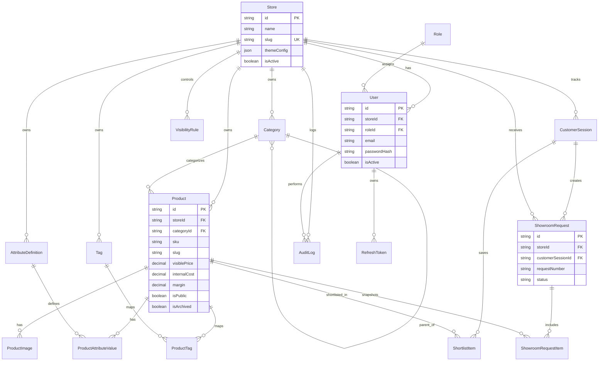

# ER Diagram

The schema is intentionally store-aware so that multi-tenant SaaS expansion can happen later with minimal redesign.

## Relationship Notes

- `Category.parentId` supports nested category trees and must be recursion-safe in service logic.
- `ProductTag` is the join table for the many-to-many relationship between products and tags.
- `ShowroomRequestItem` stores product snapshots so historical requests remain accurate even if products change later.
- `VisibilityRule` enables field-level public/internal response control.
