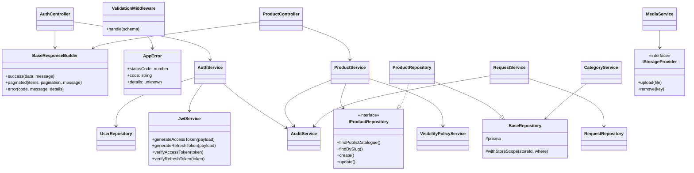

# Class Diagram

The class diagram focuses on key backend application classes and their dependencies.

## OOP Notes

- Controllers encapsulate transport logic and delegate domain behavior.
- Services provide abstraction boundaries for business workflows.
- Repositories hide Prisma details behind stable contracts.
- Interfaces keep storage and data-access strategies swappable.
- Shared base classes reduce repetitive infrastructure code without overusing inheritance.
