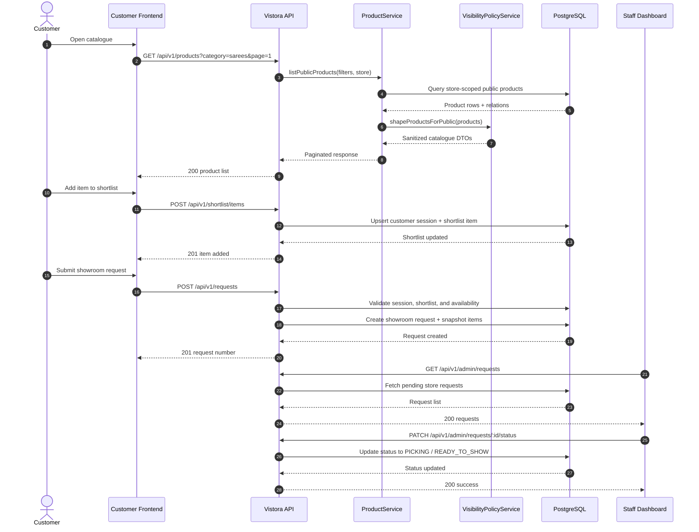

# Sequence Diagram

## Main Customer-to-Staff Flow

## Supporting Sequences

### Admin Login

1. Admin submits email and password.
2. `AuthService` validates credentials and user status.
3. `JwtService` issues an access token and refresh token.
4. Refresh token hash is persisted for revocation and rotation.

### Product Creation / Update

1. Admin submits a typed payload.
2. Validation middleware sanitizes and validates the request.
3. `ProductService` checks store-scoped uniqueness for SKU and slug.
4. Prisma transaction updates product, tags, attributes, and images.
5. `AuditService` stores before/after metadata.

### Visibility Rule Enforcement

1. Product data is fetched with related category, images, and tags.
2. `VisibilityPolicyService` receives the viewer role context.
3. Hidden fields such as `internalCost`, `margin`, and `supplierName` are removed for public responses.
4. Staff/admin payloads are shaped according to role permissions.
