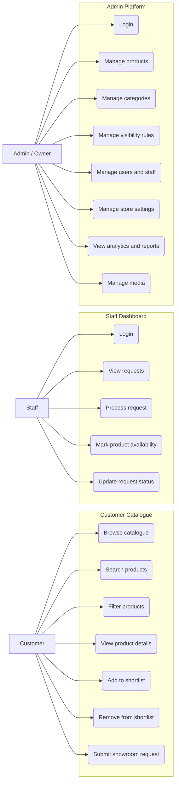

# Use Case Diagram

The diagram below shows the primary actors and their responsibilities in Vistora.

## Notes

- Customers can complete the shortlist and request flow without creating a full account.
- Staff focus on operational request handling rather than catalogue administration.
- Owners and admins control sensitive information visibility and store configuration.
